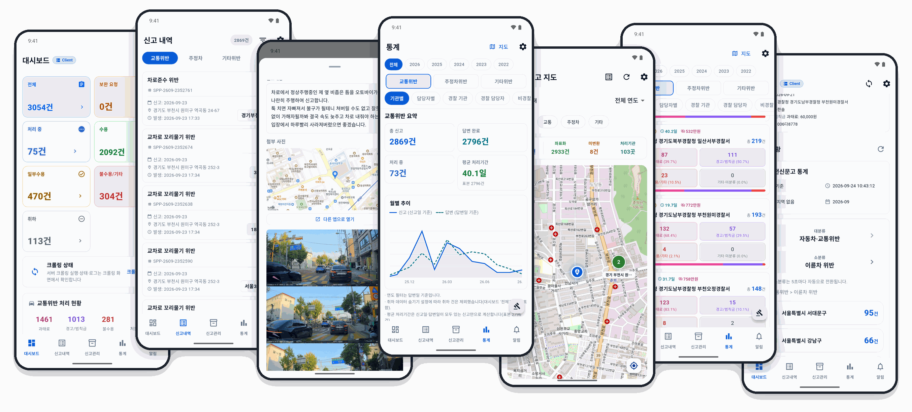
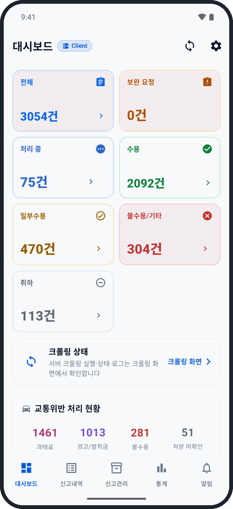
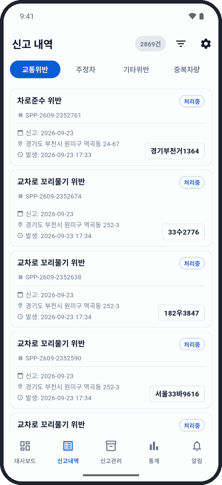
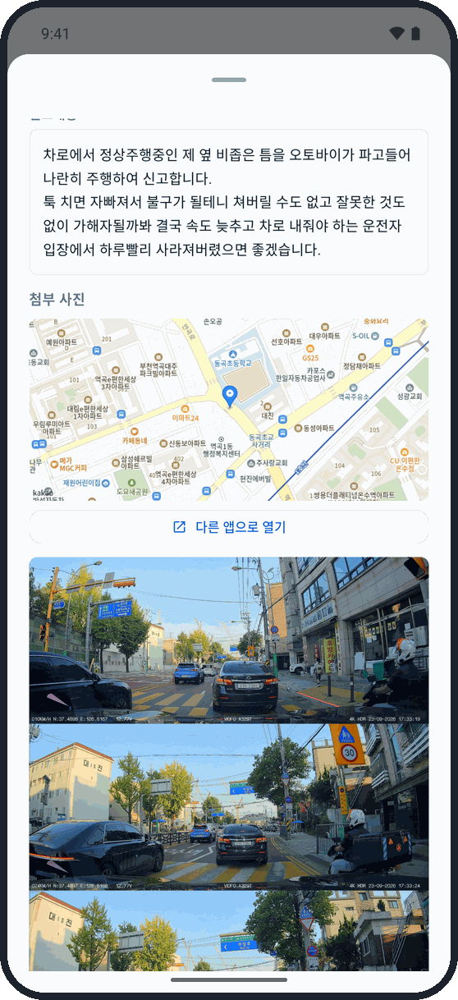
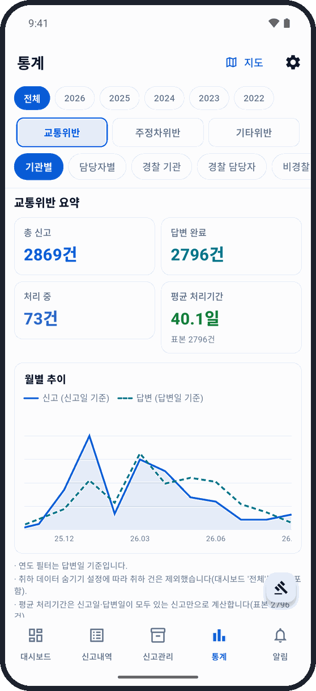
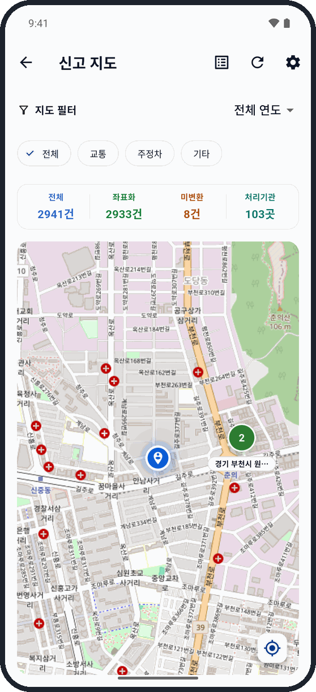
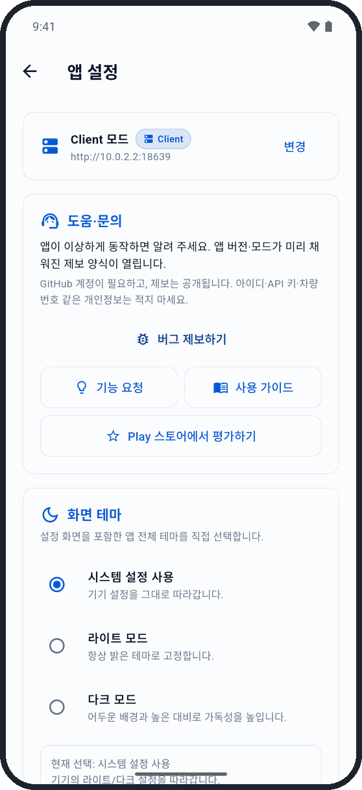

# 나만의 안전신문고 — Android 앱

  

> 안전신문고에 신고한 내역을 한곳에 모아 보여 주고, 처리 결과가 나오면 알려 주는 Android 앱입니다. 
> 신고할 때마다 안전신문고 앱을 열어 하나하나 확인할 필요 없이, 과태료가 나왔는지·불수용됐는지·어느 기관이 빨리 처리하는지를 한눈에 볼 수 있습니다.

  <picture>
    <source media="(prefers-color-scheme: dark)" srcset="example-dark.png" />
    
  </picture>

> ⚠️ 이 앱은 안전신문고의 **공식 앱이 아닙니다.** 행정안전부나 정부기관과 관계없는 개인 개발 앱이며,
> 내 신고 내역을 보기 좋게 정리해 주는 도구입니다. 신고 접수와 민원 처리는 안전신문고 공식 앱·웹에서 해 주세요.

---

## 이런 게 됩니다

- **처리 결과 알림** — 신고 처리 상태가 바뀌면(답변 완료, 수용, 과태료 부과 등) 알림으로 알려 줍니다.
- **내 신고 한눈에 보기** — 교통위반·주정차·기타 신고를 한 화면에서. 과태료·경고·불수용 같은 처분 결과가 색으로 구분돼 보입니다.
- **통계** — 총 신고, 답변 완료, 처리 중, 평균 처리 기간을 카드로 보여 주고, 월별 신고·답변 추이를 그래프로 그려 줍니다.
  기관별·담당자별로 과태료가 얼마나 나왔는지, 처리가 얼마나 걸렸는지도 비교할 수 있습니다.
- **같은 차량 모아 보기** — 같은 차를 여러 번 신고했다면 차량번호별로 묶어서 보여 줍니다.
- **중복 신고 정리** — 같은 내용으로 두 번 접수된 신고를 찾아 대표 1건으로 묶을 수 있습니다.
- **감시 목록** — 꼭 챙겨 볼 신고를 따로 모아 둡니다.
- **별점(만족도 조사) 한꺼번에** — 여러 신고를 골라 한 번에 별점을 줄 수 있습니다. 이미 참여했거나 아직 답변이 없는 신고는 알아서 건너뜁니다.
- **신고 지도** — 신고한 위치를 지도에 모아 보여 줍니다.
- **다크 모드** — 밝은 화면/어두운 화면/기기 설정 따라가기 중에서 고를 수 있습니다.
- **원문 바로가기** — 신고 상세에서 안전신문고 앱이나 공식 사이트로 바로 이동할 수 있습니다.

---

## 두 가지 사용 방식

처음 실행할 때 둘 중 하나를 고릅니다. 나중에 설정에서 바꿀 수 있습니다.

| 방식 | 이렇게 동작해요 | 이런 분께 |
|------|------|-----------|
| **Standalone** (앱만으로) | 앱이 내 안전신문고 계정으로 직접 로그인해서 신고 내역을 가져옵니다. 따로 준비할 것이 없습니다. | 바로 써 보고 싶은 대부분의 사용자 |
| **Client** (내 서버와 연결) | 집에 켜 둔 라즈베리파이·PC 서버가 24시간 신고 내역을 모으고, 앱은 결과를 받아 봅니다. | 서버를 직접 운영하며 자동 수집·엑셀/구글 시트 연동까지 쓰고 싶은 분 |

---

## 다운로드

- [Google Play 스토어](https://play.google.com/store/apps/details?id=com.fentanest.mysafetyreport)
- [GitHub Releases](https://github.com/Fentanest/safetyreport-mobile/releases) — 설치 파일(APK) 직접 받기

**Android 7.0 이상**에서 쓸 수 있습니다.

---

## 앱만으로 쓰기 (Standalone)

1. 앱을 열고 **Standalone 모드**를 고릅니다.
2. 안전신문고 **아이디·비밀번호**와 **휴대폰번호**를 입력하고 로그인합니다.
   (휴대폰번호는 별점을 주거나 내가 준 별점·사유를 확인할 때만 씁니다.)
3. 첫 동기화에서 지금까지의 신고 내역을 모두 가져옵니다. 신고가 많으면 몇 분 걸릴 수 있습니다.
4. 끝. 이후에는 앱을 열 때마다 새 답변을 확인합니다.

### 알림으로 자동 확인하기 (선택)

설정에서 **알림 접근 권한**을 허용하면, 카카오톡이나 안전신문고 앱에 신고 관련 알림이 올 때
앱이 그 신고만 골라서 바로 확인하고, 처리 상태가 바뀌었으면 알려 줍니다.

### 로그인은 이렇게 지켜집니다

- 비밀번호는 휴대폰의 보안 저장소에 암호화해서 저장하고, 안전신문고 외에는 어디에도 보내지 않습니다.
- 안전신문고 로그인은 1시간마다 풀리지만, 앱이 저장된 정보로 **알아서 다시 로그인**합니다.
- 안전신문고에서 비밀번호를 바꾸는 등 다시 로그인해야 할 때는, 대시보드 맨 위에 **"재로그인이 필요합니다"** 안내가 뜨고
  하루에 한 번 확인해서 **알림**으로도 알려 줍니다. 안내의 **재로그인** 버튼을 누르면 바로 로그인 창이 열립니다.
- 인터넷이 잠깐 끊겼거나 안전신문고가 점검 중일 때는 재로그인을 요구하지 않고 "잠시 후 다시 시도"라고 알려 줍니다.

---

## 내 서버와 연결해서 쓰기 (Client)

집에 항상 켜 두는 라즈베리파이나 PC에 수집 서버를 설치해 두면, 앱을 열지 않아도 서버가 정해진 시간마다 신고 내역을 모으고 결과를 앱으로 보내 줍니다.

**설치 안내**

1. 프로젝트 소개·사용법 — <https://hb.worklazy.net/mysafetyreport/>
2. 라즈베리파이 서버 설치 — <https://hb.worklazy.net/raspberry-pi-mysafetyreport-setup/>
3. 서버 프로그램(GitHub) — <https://github.com/Fentanest/safetyreport>

**앱 연결**

1. 앱을 열고 **Client 모드**를 고릅니다.
2. 서버 주소를 입력합니다. (예: `https://my-server.example.com` 또는 `http://192.168.1.100:6819`)
3. 서버 웹 화면의 **기기 연동** 페이지에서 받은 API 키를 넣습니다.
4. **연결 테스트** → **저장**.
5. 설정에서 **백그라운드 서버 연결**을 켜 두면, 수집이 끝날 때마다 바로 알림을 받습니다.

알림 접근 권한을 허용하면 카카오톡·안전신문고 알림이 올 때 서버에 그 신고만 바로 확인해 달라고 요청합니다.

---

## 화면 둘러보기

<table>
  <tr>
    <td align="center" width="33%"> <b>대시보드</b> 처리 결과를 색깔 카드로 한눈에</td>
    <td align="center" width="33%"> <b>신고내역</b> 교통·주정차·기타, 차량번호와 처리상태까지</td>
    <td align="center" width="33%"> <b>신고 상세</b> 신고 내용, 첨부 사진·동영상, 답변</td>
  </tr>
  <tr>
    <td align="center"> <b>통계</b> 총 신고·답변 완료·평균 처리기간, 월별 추이</td>
    <td align="center"> <b>신고 지도</b> 신고한 곳을 지도에서</td>
    <td align="center"> <b>설정</b> 버그 제보·가이드·테마를 맨 위에서</td>
  </tr>
</table>

아래쪽 탭 5개로 움직입니다.

| 탭 | 무엇을 보나요 |
|----|------|
| **대시보드** | 전체·수용·불수용·처리 중 건수, 최근 3일 사이 답변 온 신고, 감시 목록, 전국 신고 현황. 맨 위 카드에서 **동기화(또는 크롤링)** 를 바로 시작할 수 있습니다. |
| **신고내역** | 교통위반 / 주정차 / 기타 / 같은 차량 묶음. 검색과 상세 필터(처리상태, 별점, 위반법규, 기관 등)로 원하는 신고만 골라 봅니다. |
| **신고관리** | 별점 주기 / 감시 목록 / 중복 신고 / 데이터 수정 |
| **통계** | 요약 카드와 월별 추이 그래프, 기관별·담당자별 처리 결과. 항목을 누르면 해당 신고 목록으로 이어집니다. |
| **알림** | 지금까지 받은 알림 기록(크롤링 현황 / 신고 결과 / 별점 주기) |

오른쪽 위 **톱니바퀴**를 누르면 설정이 열립니다. 테마 선택, 권한, 백업·복원과 **파일 관리**(설정 › 데이터 관리), 도움·문의가 모여 있습니다.

**알아 두면 편한 것**

- 신고 카드를 **길게 누르면** 여러 개를 고를 수 있습니다. 고른 신고를 복사하거나, 감시 목록에 넣거나, 한 번에 별점을 줄 수 있습니다. **뒤로 가기**를 누르면 선택이 풀립니다.
- 신고 상세의 **첨부 동영상은 화면에 보이면 알아서 불러옵니다.** 스크롤하는 동안에는 기다렸다가 한 개씩 불러와서 화면이 버벅이지 않습니다.
- 처리상태는 색으로 구분됩니다: 보완 요청(주황), 처리 중(파랑), 답변 완료(청록), 수용(초록), 일부수용(노랑), 불수용·기타(빨강), 취하(회색), 과태료(분홍), 경고·범칙금(보라).
- 안전신문고가 보완을 요청한 신고는 **누가 언제 요청했는지, 몇 번째 보완인지**까지 상세에서 볼 수 있습니다.

---

## 방식별 기능 비교

| 기능 | Standalone | Client |
|------|:----------:|:------:|
| 신고 목록·검색·상세 필터 | ✅ | ✅ |
| 처리상태 변경 알림 | ✅ (앱을 열 때·알림 감지 때) | ✅ (서버가 수집할 때마다) |
| 통계(요약 카드·월별 추이·기관/담당자별) | ✅ | ✅ (요약 카드·월별 추이는 서버 최신 버전 필요) |
| 중복 신고 정리 / 감시 목록 / 데이터 수정 | ✅ | ✅ |
| 별점 한꺼번에 주기 | ✅ | ✅ |
| 신고 지도 | ✅ | ✅ |
| 다크 모드 | ✅ | ✅ |
| 백업 / 복원 | ✅ | ✅ |
| 엑셀 내보내기 | ✅ (직접 실행) | ✅ (자동) |
| 앱을 꺼 둬도 24시간 자동 수집 | ❌ | ✅ |
| 구글 시트 연동 / 크롬 확장 프로그램 | ❌ | ✅ |
| 자세한 수집 로그 | ❌ | ✅ |

---

## 자주 묻는 질문

**Q. 비밀번호가 안전한가요?**
A. 휴대폰의 보안 저장소(Android Keystore)에 암호화해 저장하고, 안전신문고 로그인에만 씁니다. 로그인할 때도 안전신문고 공식 웹과 같은 방식으로 암호화해서 보냅니다.

**Q. "재로그인이 필요합니다"라는 안내가 떠요.**
A. 안전신문고가 저장된 비밀번호를 받아 주지 않는 경우입니다(비밀번호를 바꿨거나 계정이 잠긴 경우 등). 안내의 **재로그인** 버튼을 눌러 다시 로그인해 주세요.

**Q. "안전신문고에 연결하지 못했습니다"라고 떠요.**
A. 인터넷이 끊겼거나 안전신문고가 점검 중일 때 나옵니다. 다시 로그인할 필요는 없고, 잠시 후 다시 시도하면 됩니다.

**Q. 동기화하다가 앱을 닫아도 되나요?**
A. 됩니다. 동기화 중에는 알림 표시줄에 진행 알림이 떠 있고, 도중에 멈추더라도 확인하지 못한 신고는 다음에 앱을 열 때 이어서 처리합니다.

**Q. 이 앱에서 신고를 할 수 있나요?**
A. 아니요. 이미 접수한 신고를 모아 보고 관리하는 앱입니다. 신고 접수는 안전신문고 공식 앱·웹에서 해 주세요.

**Q. 엑셀 파일을 눌렀는데 "열 수 있는 앱이 없습니다"라고 떠요.**
A. 휴대폰에 엑셀이나 구글 스프레드시트 같은 앱이 없으면 공유 화면이 대신 열립니다. 드라이브·메일 등으로 보내서 열어 보세요.

**Q. Standalone과 Client를 바꿀 수 있나요?**
A. 설정 맨 위 연결 방식 카드의 **변경**을 누르면 됩니다. Client → Standalone으로 바꿀 때는 서버에 있던 신고 내역을 그대로 가져올 수 있고,
Standalone → Client로 바꿀 때는 기존 데이터를 휴대폰에 자동으로 백업해 둡니다.

---

## 문제가 생기면 알려 주세요

앱의 **설정 맨 위 "도움·문의"** 카드에서 **버그 제보하기**를 누르면, 앱 버전과 사용 방식이 미리 적힌 제보 양식(GitHub)이 열립니다.

- GitHub 계정이 필요하고, 제보 내용은 누구나 볼 수 있게 공개됩니다.
- **아이디·비밀번호·API 키·차량번호 같은 개인정보는 적지 마세요.**
- 같은 카드에서 기능 요청, 사용 가이드, Play 스토어 평가하기도 할 수 있습니다.

직접 가기: <https://github.com/Fentanest/safetyreport-mobile/issues>

---

## 함께 쓰는 프로젝트

- [safetyreport](https://github.com/Fentanest/safetyreport) — Client 방식에서 쓰는 수집 서버
- [safetyreport-chromeextension](https://github.com/Fentanest/safetyreport-chromeextension) — 크롬 확장 프로그램 (선택)

개발자용 구조 설명은 [AGENTS.md](AGENTS.md)와 [docs/](docs/)에 있습니다.

---

## 라이선스

[LICENSE](LICENSE) 참조.
