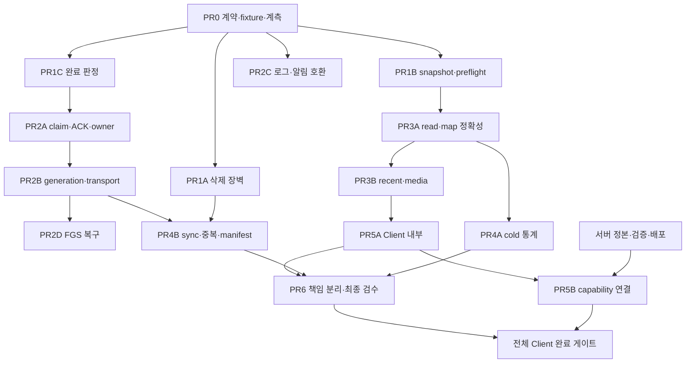

# safetyreport-mobile/dev 리팩터링 계획 검토·상세화

상태: **계획 제출용. 구현 승인 아님. 앱·테스트·벤치마크·빌드·기기·실제 외부 작업 모두 NOT_RUN.**

## 1. 결정과 근거

기본안은 삭제·교환·완료·ACK의 안전 조건을 작은 변경으로 먼저 보강하고, 기존 bounded 경로의 cold 준비와 반복 계산을 줄인 뒤 책임을 분리하는 것이다. 전체 Report 선로딩, 샘플링, 기능 삭제, largeHeap, 권한 완화, 프레임워크 교체, 최소 Android 상향은 채택하지 않는다. 계획 제출 뒤 작업을 종료한다.

검토 시점 로컬 branch는 `dev`, HEAD는 `ea183b2a94b62ec9bd51b0f2ab8bd9e72f075b60`이다. 입력 감사 SHA와 동일하고 tracked unstaged/staged diff는 없다. 로컬 원격 추적 ref `origin/dev`도 같은 SHA, `origin/main`은 `c64be69a91999c703bc173fe87aa855fc249e930`이다. 원격 서버를 새로 조회하지 않았으므로 이것을 최신 원격 HEAD 확인이라고 부르지 않는다. fetch/reset/checkout은 하지 않았다. 사용자 기존 미추적 `kr.go.safepeople-157/`, `resultstest/`, `safepeople.md`는 검토·수정·정리 대상에서 제외했다.

입력 문서는 요청 순서 02→01→04→03으로 부록까지 읽고, 05·06도 읽었다. 원문은 [input/](input/00_README.md)에 바이트 그대로 보존한다. ZIP과 각 입력의 SHA256은 [provenance.json](provenance.json)에 있다. 원 감사의 624파일·447텍스트/blob 대조·작은 SQLite 식 실험은 과거 조사다. 이번은 624 tracked 경로 목록 확인과 지정 구간 정적 대조다. 파일별 실제 상한은 [review-scope.csv](review-scope.csv)에 기록한다. 이번에 내용/구조를 대조한 경로는 76개(전체읽기27·핵심구간18·부분읽기25·구조스캔6), 나머지548개는 목록만이다. 전체읽기도 모든 branch 증명이 아니다. 긴 출력에서 잘린 문서는 전체 검토로 올리지 않는다. Kotlin/Flutter 함수 호출, SQLite 실험, 분석기 및 하네스를 실행하지 않았다.

근거 구분은 **현재 코드 구조 / 발생 가능성의 추론 / 입력의 과거 실행 보고 / 제안 설계 / 후속 NOT_RUN 검증**이다. `현재 확인`은 조건부 실패 경로가 소스에 있다는 뜻이며 운영 피해나 race 재현을 의미하지 않는다. 27개 분류는 [findings.md](findings.md), 기계 판독은 [findings.json](findings.json)을 따른다. 현재 확인 25개, 추가 근거 필요 1개(N-01), 미재현 1개(N-08). 이미 해결·반증으로 전체 발견을 닫을 증거는 없었다. 발견 안의 이미 적용된 방어는 별도로 보존한다.

안전성 우선순위 5개는 S-02 부재 삭제, DB-01/02 부분 snapshot/import 성공, S-01 조기 완료, N-04/S-03/S-04 unacked 작업 유실, N-02/03/S-06 세대·권한 불일치다. N-05 원문 로그 제거는 독립적인 작은 변경으로 일찍 진행 가능하다. 성능 후보 5개는 최초 index/registry, high-cardinality CTAS·반복 누산, giant 중복 staging/publish, Client limit1+page/full decode, sync progress·건별 중복·manifest 반복이다. 후보의 실제 비용·개선율은 아직 미측정이다.

### 코드 대조 정정

아래는 해당 문서의 이관 원문·과거 설명을 현재 구현으로 오인하지 않도록 남기는 대조 정정이다. 이번에는 정본 계약 사본을 수정하지 않는다. 후속 해당 PR의 문서 변경 위치도 지정한다.

| 문서 | 현재 대조 사실 | 후속 정정 위치 |
|---|---|---|
| `docs/architecture/overview.md` 최근 답변 전체 재구성 설명 | Provider 160~199는 preview들로 재구성할 수 있고 화면에 페이지가 없다 | PR3B1, 그 문서의 코드 대조 정정 |
| `docs/architecture/community-gate.md` `rebuildRunId` 아직 없음/T6 no-op 설명 | `RebuildEngine.run:76`이 runId를 전달하며 `SyncEngine.start:180`에 실제 인자가 있다. wiring의 manifest hook도 구현됐다 | PR1C/PR4B3, 코드 대조 정정 |
| `docs/architecture/bounded-reads.md` WAL snapshot 설명 | `_prepareExternalDbSnapshot:3305`에서 copy/open/checkpoint 오류를 무시하고 sidecar를 지운다. 문서의 일반 성공 설명은 실패 보존 증명이 아니다 | PR1B1, 코드 대조 정정 |
| `docs/design/statistics-spec.md` 초기 §1~4와 후속 §8~9 | 현재 통계 연도는 답변일, 월별 신고는 신고일, Sunwi는 통계 하단이다. 초기 신고일 연도/Top N 제안을 적용하지 않는다 | PR3A2/PR4A, 후속 결정 우선 표기 |
| Android runtime·서비스 주석의 FGS 지속 표현 | native sync FGS는 engine을 소유하지 않는다. HOME와 task removal/process death의 지원 범위는 미검증 | PR2D, 코드 대조 정정 |
| 개인정보 방침 §7 | `setConfig:788`의 API 키 prefs 및 manifest cleartext 허용은 Keystore/TLS 일괄 문구와 다르다 | PR6B2, 실제 저장소·전송 범위에 맞춰 정정 |

## 2. 보존 계약과 실행 지도

AGENTS/PROJECT_RULES가 기능·권한 기준이다. `data-contracts.md`와 `storage-contract.json`이 교환 목록 기준, `selfhost-compat/README.md`가 protocol 기준, community-ingest가 capture/ACK/rebuild 기준이다. 세 프로젝트 스킬의 기능·통계·실렌더 검수 절차를 후속 계획에 적용하며 실행 승인을 확대하지 않는다.

```text
main / native intent → auth·동의 gate → Provider.init → lazy 5탭/route
Standalone read: 화면 → LocalDb/ReportQuery → native SQL → 좁은 page → Dart DTO/누산 → Provider/UI
Client read: 화면 → ApiService → protocol3 + gate → HTTP bytes/UTF8/JSON/DTO → UI
Standalone write: manual sync 또는 native inbox drain → 공식 목록/상세
  → retry intent → community capture transaction → 개인 upsert → 중복 projection → 변경 알림
Community upload: gate/context → outbox 선택 → lease/heartbeat → immutable envelope → ACK 적용
Native: NotificationService / WsService / SyncForegroundService ↔ prefs / MethodChannel ↔ Dart
```

SQLite 실행은 native worker, Dart 날짜·상태·금액 parse/집계와 JSON·build는 기본 UI isolate다. registry 초기화와 duplicate digest/majority는 기존 worker 경계를 유지한다. `async`만으로 CPU offload라고 하지 않는다. WorkManager background isolate의 static flag는 UI isolate와 공유 락이 아니다.

| 자료·writer | 실제 소유권/보호 | 취소·publish 경계와 부족한 부분 |
|---|---|---|
| reports/raw: SyncEngine, auto-drain, 상세 저장; override: editor; rating: 사용자 제출 | `_backgroundWork`는 close 방지 refcount, `_fileOp`는 file operation zone barrier | save transaction은 끝내고 이후 예약 중단. manual/drain 업무 배제는 별도 필요 |
| 중복 decision: 사용자; group/member/digest: builder | `_pending[db]` 직렬화, persistent revision trigger, 128페이지, 독립 staging, shared transaction publish | source/decision revision 재확인·최대3 retry 유지. foreign writer·giant hash 비용 검증 |
| TEMP/summary/stats/map cache | connection+revision/data_version+registry+filter, stats read tail, sequence/epoch | 큐 진입 전 취소 재검사와 페이지 취소 유지. 실행 중 native SQL 즉시 중단 보장 없음 |
| 개인 DB 교환/export: 설정·이관 | version5/16·owner 검사, private staging, close/file barrier, 직전 backup3개 | preflight/reconcile 전 publish 금지. 검증 후 교체까지 writer 재진입·owner 변화 추가 검사 |
| retry JSON: capture/rating | flush+rename, community.db 장애와 독립 | rename만으로 RMW 직렬화 안 됨. corrupt를 empty로 바꾸는 경로도 막는다 |
| native QUEUE/PENDING/HISTORY: Kotlin+Dart | native unique append, Dart read/번호 dedupe | MAX200 eviction, 번호 기반 remove가 새 event까지 ACK할 수 있음 |
| community journal/latest/staging: capture/rebuild | capture-before-personal-save, DB transaction, runId | 두 DB를 하나의 원자 transaction으로 가정 금지; rebuild terminal 검사 필요 |
| outbox/manifest: uploader/wiring/background | upload lease·heartbeat, immutable event/revision/payload, ACK 정책 | 후속 await 세대 검사·조건부 claim, manifest per-run lease·client 수명 필요 |
| prefs/secure: Provider·auth·native | datasetEpoch는 Dart 화면 결과 보호; auth 일부 회전 비교 | config generation을 native dispatch/callback과 background에 전달해야 함 |
| 첨부/temp/export: detail·Kotlin MediaStore | same-origin credential, decode 크기, pending/64KiB/길이 검증 | 외부 열기 cache는 filename identity 보강; 사용자 완성 파일은 cleanup 제외 |

제안 신규 `OperationContext`는 mode, owner, origin/config generation, dataset epoch, connection identity, source/registry revision, runId와 취소 상태의 불변 snapshot이다. 비밀 값은 로깅하지 않는다. dataset별 sync/drain은 단일 owner, drain의 fallback은 owner 내부에서 실행하여 자기 락 재획득을 피한다. 읽기+짧은 save는 connection 정책 내 허용, 교환은 신규 admission을 닫고 기존 owner 종료를 확인한다. 계정/모드 변경은 generation 증가→admission 중지→옛 작업 종료/unknown 기록→새 scope 시작 순이다.

UI의 결과는 preparing/ready/empty/stale/partial/busy/retryable/blocked/failed/cancel_requested/cancelled/unknown_outcome을 구분한다. 기존 public facade에는 adapter를 둔다. cancelled는 transport 종료나 SQL/atomic save 종료를 확인한 뒤의 상태다. 로컬 완료, outbox 등록, 중앙 durable ACK, held/published는 각각 다른 완료다. 별점·enqueue POST 응답 유실은 미접수 증거가 아니며 멱등 계약 없이 자동 재POST하지 않는다.

### 기능과 의미 검수 범위

하단0~4, 신고내역4분류, 관리4탭, 알림3탭, 옛native5/6, quick_sync/quick_crawl, 상세·출처/비공식 고지, 복사·별점·감시·수정·중복대표·선택 취소·백업/복원·파일 공유를 두 모드 모두 유지한다. 별점0/미평가·1,000 rune·개행·취소 미제출·오류 draft·중복 admission을 유지한다. CSV의 각 existing 행을 후속 검수 ID에 연결한다. UI 래퍼 삭제는 실제 모든 caller와 두 enum 모드 분기를 확인한 뒤만 가능하다.

raw/canonical/lifecycle와 중첩 처분은 별개다. 총계·표·차트·지도·목록·다운로드의 projection/취하/NULL/날짜/법규 분모를 공용 벡터로 대조한다. 중복차량을 네 번째 합산 카테고리로 만들지 않는다. confirmed군만 대표 projection, nonrepresentative 감시 계승, 수동 대표·동률·not_duplicate/review_required 보존. 기관 이름 대신 registry identity로 묶고 원문은 보존한다. 확정/추정 금액은 필드·합계·라벨·export를 분리하며 월별 과태료/랭킹3탭/인사이트/중복 KPI는 추가하지 않는다.

## 3. 변경 단위와 의존성

각 행은 독립 리뷰 단위다. 파일 이동, 정확성, 성능을 섞지 않는다. 기존 파일명 약칭의 전체 경로와 PR6 신규 모듈 후보는 [file-map.md](file-map.md)에 연결한다. 제안 신규는 명시한다. 자세한 반례·보호·acceptance·rollback은 같은 ID의 findings 카드와 결합한다. 현재 어떤 행도 구현/검증을 시작하지 않았다.



서버 게이트 미완료가 모바일 독립 PR의 착수를 막지는 않는다. LocalDb, Provider/main, community store/gate, 계약, Manifest/Gradle/pubspec/테마는 각각 한 담당자가 소유하고 같은 파일의 PR는 순서대로 적용한다. 이번에는 다른 에이전트나 독립 검수자를 호출하지 않았다.

| 단위 | 변경 파일·함수와 before→after | facade/저장/API 영향·대안 |
|---|---|---|
| PR0 | `performance_trace.dart` record/sql, tests/support, contracts·docs; source 범위·27ID·synthetic barrier/clock/transport 설계 → 재현·계측 가능한 계약 | 제안 신규 `test/support/refactoring_faults.dart`, `test/support/refactoring_oracles.dart`; 제품 동작 변화 없음. 원문 로그 계측 기각 |
| PR1A | `sync_engine.dart` `_run`, `standalone_api_service.dart` fetchTotalCount/fetchReportList, LocalDb removeReportsNotIn; null/short→성공목록 → shape·unique·page 전진 증거+inventory 결과 | 제안 신규 `lib/services/sync_inventory.dart`; HTTP DTO 내부 adapter. total만 맞으면 삭제하는 안 기각. run staging은 교환 DB에 새 영속 컬럼을 넣지 않는 임시 작업 DB 기본 |
| PR1B1 | LocalDb `_prepareExternalDbSnapshot`, copyDatabaseConsistent, exportBackup; 오류무시→실패 중단·private 완성 snapshot 검증 | 외부 원본 read-only, 입력 종류별 live/portable 구분. mtime/size 재확인만으로 live snapshot 보장 기각 |
| PR1B2 | LocalDb `_validateServerDbSchema`, `_readServerReportRows`, `_readServerTablePages`, `_coerceForColumn`, importFromServerDb/replaceFromBackup; JOIN/skip/REPLACE→preflight/reconcile 후 bounded 변환 | schema5/16 고정. 지원 키·SQL type 확인, 모호한 orphan·충돌은 거절. unsupported 값을 자동 정규화하는 안 기각 |
| PR1B3 | LocalDb `_commitImportedDatabaseLocked`, `_rotateCommunityDataset`; 개인파일+community 선회전→prepare/commit 복구 기록으로 둘의 중도 실패 연결 | 제안 신규 exchange journal(교환 schema와 분리), versioned reader. 모든 writer 재admission fence. 파일 delete 후 실패 rollback은 기존 backup 유지하고 진단. 운영 DB 다운그레이드 기각 |
| PR1C | `community_rebuild.dart` RebuildEngine.run/_runToCompletion/_commit, `rebuild_helpers.dart` mergeRebuildStaging, SyncEngine item helpers; 반환 list/permanent만→영속 terminal/owner/lease 검사+merge+완료 표시 transaction | merge는 삭제 없음. 개인 DB save와 capture의 두 DB 원자성은 별도 journal/checkpoint. pending를 permanent 자동 처리해 완료시키는 안 기각 |
| PR2A1 | Kotlin PrefsInbox.put, Dart prefs_inbox·pending_queue read/remove; MAX200·번호 ACK→history retention와 durable processing event claim/ACK 분리 | 제안 신규 native `ProcessingInboxStore.kt`(private SQLite), Dart `processing_inbox.dart` bridge. 기존 키 migration-copy→verify→receipt→legacy 제거. TTL로 unacked 폐기 기각 |
| PR2A2 | auto_sync `_drainIfPending`/`_tryFetchSingle`, SyncEngine.start, standalone API, retry_store add/remove; 독립bool·문자열 오류→dataset owner·typed outcome·RMW 직렬화 | 제안 신규 operation coordinator/failure types. 단일 isolate RMW queue+파일 lease를 비교, 다중 isolate는 OS 파일 lock/journal·crash recovery 검증 필요. community.db 의존만으로 복구 journal 이전 기각 |
| PR2B1 | Provider.setConfig/settings, native WS startWsLoop/connectAndBlock·Notification sendEnqueue, compatibility·ClientGateGuard, community gate/uploader; old ctx→generation fence | native persistent config generation+불변 probe 결과. resetConfig/Standalone stop 보호 유지. 최초 check 한 번으로 모든 await 보호한다고 하는 안 기각 |
| PR2B2 | auth login/relogin, standalone API `_getWithRetry`, ApiService `_sendWithRetry`, native sendEnqueue; timeout→owned transport whole-operation deadline/abort와 shared-refresh waiter 규칙 | 제안 신규 transport adapter. 기존 HTTP retry/POST one-shot 유지. shared client 강제close·timeout 단순 연장 기각 |
| PR2C1 | NotificationService.onNotificationPosted/extractAndEnqueue; prefilter raw log→필터·비식별 counter | wire 변화 없음, release R8 logstrip만 의존 기각 |
| PR2C2 | MainActivity.createAppNotifChannel/handleNavIntent/showNotification, NS/WS/SyncFgs 알림 producer, main._handleNativeCall/AppRoutes | API26 guard+compat builder, 채널 ID 보존, semantic tag·PI identity, command receipt 소비. 옛nav5/6 mapping 유지. ID 시작값만 바꾸는 안 기각 |
| PR2D | SyncEngine.acquireFgs/releaseFgs, SyncForegroundService.onTimeout/onStartCommand, MainActivity handler, background worker | FGS 시작 ack·owner 상태·checkpoint→중단/재개. headless 전면 변경은 별도 결정. force-stop 지속 보장 기각 |
| PR3A1 | LocalDb db/_closeDb, `_ensureAgencyLookup`, `_ensureMissingLookup`, getReportPage/_getDuplicatePage/computeReportMapMissingGroups | identity-safe init reset, connection/revision/registry single-flight, atomic TEMP, count/page snapshot. TransactionExecutor 전달; parent db 호출 재진입 금지 |
| PR3A2 | LocalDb `_MapCellAccumulator.toJson`, `_AgencyAgg.add`, `_parseOverviewDate`, map/missing, geocode_utils | 직접 unknown·strict UTC calendar·지도/missing 공통 predicate; officialGeoPayload 한국 범위 쓰기는 그대로. 원문 보정 PR와 분리 |
| PR3B1 | recent_answers_screen, Provider.recentAnswerReports/refreshSummaryAndRecentAnswers, LocalDb summary 최근 SQL | preview 유지→별도 recent exact count/page·query state. 제안 신규 recent query/repository. Client full recent는 서버 계약 의존 |
| PR3B2 | report_detail_sheet `_openExternal`, client_media_access | filename cache→resource/origin/owner/generation key, `.part`+완료metadata+atomic ready, stream/deadline·취소 | 정부/CDN에 키 전송 금지. 공개 cache 영구 공유 기각. URL token은 해시 재료여도 로그·파일명 노출 금지 |
| PR4A1 | LocalDb `_open`/읽기 index, agency_registry load/cache | index/registry 지연 후보를 비용별 검증; 재준비 중복 제거 → single-flight immutable snapshot | first frame·첫 결과·완료 모두 측정. schema 변화 없이 index만. 준비를 다른 화면으로 숨기는 안 기각 |
| PR4A2 | computeStatsBundle, `_StatsCategoryAccumulator`, `_OverviewAccumulator`, `_AgencyAgg`, statistics `_visibleRows` | 1,000그룹 stream 유지, 그룹당 metric 한 번 parse, all/category 누산 재사용, result/filter/sort revision view memo | G≈N이면 GROUP 키 변경을 의미별 증명한 후 비교. 좁은 순수 누산 worker는 복사 비용 포함 실험. persistent aggregate는 invalidation 증명 전 보류 |
| PR4B1 | bounded_duplicate_rebuild `_prepare`/_legacyMajorities/_publish, duplicate repository.updateGroup | 128/ack/revision/staging 유지. decision-only 변경의 영향군 refresh 후보 | giant worker hash resident·최종 publish 측정; majority/tie 원형 동등 필수. source/decision revision 분리의 persistent 의미 변경은 공동 계약 검사 후만 |
| PR4B2 | SyncEngine `_run`/logUploadProgress, auto-sync `_tryFetchSingle` | account-sized List/Map→narrow run DB·SQL join, 누적ID 재조회→정확한 run delta+reconcile, 건별 duplicate→bounded checkpoint 결합 | 결과 알림/ACK는 변경 단위별 내구 기록. coalesce로 중간 projection 의존을 잃으면 기각. pace/fsync 제거 금지 |
| PR4B3 | gate poll/_ensureWriterConnection, CommunityWiring.refreshManifest, server_completed.refreshServerCompleted, store | full List/Set→page staging 검증+atomic replace, per-run lease·renew·finally close·cursor 전진 검사 | 기존 token/total/unique 검사는 이미 구현, 유지. unchanged/version/delta endpoint는 실제 중앙 계약 확정 전 사용 금지 |
| PR5A | ApiService decode/getReportsPage, Provider.readServerPage/watchlist, local_paged `_load` | seq는 유지, 동일 scoped inflight 공유·total 재사용·cancel/decode lifecycle | origin/owner/generation/filter/dedupe/sort/page 키. 서버 revision 없으면 동일 진행 query 세션 안 재사용을 기본, 지속 캐시는 짧은 TTL만으로 정확성 보장하지 않음 |
| PR5B | server_contract/ServerContract, ApiService/repositories, 승인된 계약 사본·벡터 | 아래 C-02~08의 확정 capability 연결 | 다른 저장소 구현은 별도 사용자 승인. endpoint 제안을 구현 호출로 승격하지 않음 |
| PR6A | LocalDb·ReportProvider·SyncEngine facade 뒤 read/analytics/exchange/run module | behavior 확인된 함수부터 기계적 이동, 이후 unreachable branch 별도 제거 | 제안 신규 repository/service 경로. public 반환/오류/side effect·초기화 순서 동일. 줄수 감소를 속도 성과로 계산 안 함 |
| PR6B1/2 | signer-free 검증 workflow(제안 신규), 기존 workflows의 검증 의존성, architecture·privacy·support 진단 | analyze/test/Kotlin/contract/lint gate와 배포 분리; mapping/hash/source 지원기간 보존·보안 문구 대조 | build wrapper 실행·VERSION/서명 변경 없음. secure migration은 native/background reader 동시 준비 전 보류. LAN HTTP 제거 기각 |

### 단계별 선행 검증·성능·통과·롤백

| 단계 | 승인 후 먼저 실패를 잡을 검증 | 측정과 통과 조건 | 롤백/보류 |
|---|---|---|---|
| PR0 | fixture 격리·원문 로그 없음·27ID completeness 정적 확인; 후속 fake barriers가 실제 호출자에 도달하는지 검증 | 실제 baseline은 미측정. source grep만인 tests를 runtime coverage로 올리지 않음 | 문서/계측만 제거 가능, 실행 권한은 별도 |
| PR1A | 401행 중 page2 short/null/duplicate/동시 동일total 교체/stop; 정상0 shape | 불완전 inventory 삭제0·raw/override/key/type 차이0; 목록·상세 완료시각 분리. page/bytes/staging peak 측정 | 삭제 보호는 유지, 수집 upsert만 유지. upstream stable snapshot 증거 없으면 absence cleanup만 보류 |
| PR1B | WAL-only·copy/open/checkpoint/disk full·orphan·cross-ID·rowid0/-1·unknown·0건; publish/rotate 각 crash | preflight→all-value reconciliation→publish만. 원본·기존DB 불변, 백업 복구. 128 JOIN·diskpeak·snapshot/reconcile/publish 각각 측정 | 이전 정상본+journal 유지; unsafe converter로 복귀 금지. type/변환 의미 변경이면 공동 게이트 |
| PR1C | 실제 SyncEngine+fake503/stop/item write 실패, retry·승인 gaps·validate 후 상태 변화 | terminal atomic 검사, pending/retryable 완료0. transaction 길이/복구 시간 측정, 중앙ACK 별도 | active run checkpoint 보존·resume 차단 필요시 명시 오류, 조기 완료 재도입 금지 |
| PR2A | inbox201/1000·same-number 새event·migration crash·ACK전후 crash·RMW interleave·busy fallback·429/503 | unacked 유실0, 새event ACK0, deadlock0. 처리 batch≤200/worker1 기본, 디스크 quota 도달은 명시 overflow | 새 queue 역호환 reader 없으면 구binary 차단. 내구 데이터 삭제 롤백 금지 |
| PR2B/C/D | A→B→A·key-only·늦은owner/register/manifest·body stall·shared refresh; API24/25/26·producer collision·intent recreation; HOME/task removal/kill/timeout | stale dispatch/commit0·비밀로그0·unknown outcome 보존·취소 후 추가 예약0. native SQL/save 종료는 별도 측정. FGS status≠engine status 금지 | fence 유지·새scope로 oldqueue 이동 금지. runtime 생존은 fixture 기기 전 NOT_RUN; headless 범위만 보류 |
| PR3A/B | TEMP interleave/open retry/count-page writer/weighted overlap·invalid day·coord; recent201/1001·filename collision/part/epoch | 정확한 union/total/type·기간 표본·missing 모집단, stale/empty/error 구분, 파생 표 부분 노출0; 정렬/SQL/decode 프레임 비용 측정 | cache/TEMP만 폐기·기존 bounded fallback. Client recent total unsupported는 공동 게이트만 보류 |
| PR4A/B | 공통벡터·legacy duplicate·same-count foreign writer·giant1/2·high G/N·progress ACK변화·cursor/lease | 동일 의미 diff0 먼저. 그 뒤 같은환경 cold 절대시간·CPU·bytes 감소, 작은data/다른탭 악화 공개 | 최적화별 작은 commit/switch, bounded oracle fallback. 불명 majority/order는 fast path 채택 보류 |
| PR5A/B | fullresponse/slowbody/filterburst·old/new server 조합; scoped page union·전체메타 | 실제 지원 필터 의미 동일·제한 라벨 유지. 전량전송/peak·requests 감소 확인. 공동 gate 없이 Client 전체 완료 금지 | capability off·업데이트/제한 안내, full preload/protocol 우회 금지 |
| PR6 | 기존 public caller·import/init/dispose·전체 feature vector·실렌더·CI 실패 gate | behavior 이동 diff0, 정확성·성능·접근성 증거별 PASS/FAIL/SKIP/NOT_RUN | 의미변경/이동 별도 revert, user DB/queue 건드리지 않음 |

### 변경 전후 결과와 신규 저장 형식의 구체 기본안

- PR1A inventory 결과는 proposed `ListInventoryResult`의 runId/ownerGeneration/declaredTotal/uniqueCount/pageEvidence/listComplete/authoritative/invalidReasons로 표현한다. listComplete와 authoritative는 다르다. run staging의 ID가 상세 처리에 쓰여도 delete authority는 자동 부여하지 않는다. 정상 upstream snapshot 보장 없는 현재 기본안은 authoritative=false다.
- PR1C의 commit 기본 조건은 run active+lease owner 일치+owner/generation 일치+list_complete=1+pending=0+failed_retryable=0+unknown item state=0이다. permanent>0이면 현재 run의 명시 gap 승인 집합이 그 permanent 집합과 같아야 한다. community transaction 안에서 이 조건, staging 최신 pointer 유효성, merge, source_generation 증가, job completed를 처리한다. 검사와 완료를 별도 await transaction으로 나누지 않는다. 개인 DB save 결과 checkpoint 실패는 재검증하여 pending/retryable로 보존한다.
- PR1B3의 제안 exchange journal은 operationId/formatVersion/ownerGeneration/sourceSnapshotRef/stagedRef/previousGoodRef/stage(prepared|publishing|published|recovery_required)만 보유한다. 토큰/원문을 기록하지 않는다. journal format과 private file path를 이전 reader가 모르면 교환 admission을 차단한다. publish 전 destination writer가 바뀌면 재검증하거나 중단한다. private source open 실패의 임시 폴더 누수도 같은 cleanup 소유권에서 처리한다.
- PR2A1의 제안 native processing schema는 eventId(unique), scopeGeneration, sourceKind, reportNumber(private), state(pending|claimed|retry_wait|blocked|terminal), claimOwner/claimUntil, attempts/nextAttempt, receivedSequence다. reportNumber를 ACK key로 쓰지 않는다. phase별 migration receipt에 legacy key 목록을 기록하고 기존 데이터를 claim/ACK된 것으로 해석하지 않는다. lease 만료 claim은 같은 eventId로 재실행하며 이미 local commit된 event는 idempotent result를 확인한다. quota 크기는 device disk baseline 뒤 정하고 quota 초과는 durable overflow/recovery_needed를 기록한다.
- PR2B2 deadline 기본 제안은 native enqueue connect10초/read20초/whole30초, auth 단계 body1MiB/whole30초, Standalone read whole20초다. 현재 retry/spacing 횟수는 확대하지 않는다. 공유 relogin에는 실행owner와 waiter취소를 분리하고 단계·전체 경과를 기록한다. 서버 DB/첨부 스트리밍은 파일크기·진행에 맞는 별도 예산이며 auth body limit을 큰 파일에 적용하지 않는다. timeout 후 아직 진행 중인 POST는 unknown으로 보존한다. 장치측정 전에 cancellation-to-idle 보장 시간을 선언하지 않는다.
- PR4A2의 제안 `RowMetrics`는 weight/strict reportedDay/responseDay/completed/dispositionUnion/confirmedAmount/estimatedAmount/validRating/agencyIdentity를 한 번 해석한다. 기존 law-option 모집단(법규 필터 전)과 통계 모집단(필터 후)을 별도로 유지한다. all/category 누산 공유는 category grouping을 실제 parser/rounding과 비교한 뒤 채택한다. view cache는 data result identity+datasetEpoch+registry identity+year/law/category/type/search/sort이며 기존 동점 이름 정렬을 유지한다.
- PR4B2 progress delta는 run-event 연결의 실제 상태 전환을 계수하고 재시작/ACK유실/상태rollback에서 SQL로 reconcile한다. counts만 영구 저장해 truth를 대체하지 않는다. checkpoint는 최대20개 event 또는 취소/작업 종료 경계 기본 제안이며 중복 refresh의 변경 알림을 원래 변경 단위로 남길 수 있을 때만 합친다. 그 증명이 없으면 기존 건별 bounded 계산을 유지한다.

## 4. DB 왕복·API·native 공동 검수

[exchange-columns.md](exchange-columns.md)는 현재 계약으로 생성한 검토용 전 컬럼 인덱스이며 정본을 대체하지 않는다. 각 교환 entity의 key set과 각 셀의 값/NULL/storage type을 비교한다. report의 title/detail·category 표이름·entry 별도표, watchlist 표↔sync_meta 변환을 각각 비교하고 API DTO까지 추적한다. server-only admin/key/change cursor는 교환 대상이 아니므로 모바일에 복사하지 않는다. sync_meta의 `watchlist`, `map_backfill_state` 예외와 `kakao_member_id` 원문 owner도 계약의 의미 변환으로 별도 대조한다. reports의 legacy raw_content와 report_raw를 혼동하지 않는다.

두 왕복 S0→M1→S2, M0→S1→M2에서 PRAGMA schema/PK/declared type/SQLite typeof와 keyed value를 비교한다. 타입 변환 허용값은 현재 정본의 항목만 whitelist로 적고 나머지는 거절한다. NULL≠빈 문자열, ID/기관코드 선행0, integer/real/text, 한글/CRLF/개행·날짜·긴 raw·override빈값·manual/동률/member·metadata를 각 열에 채운 합성 vector를 사용한다. 건수/checksum/quick_check만으로 통과하지 않는다. 일반500k와 giant500k는 별도 케이스다. `_coerceForColumn`의 숫자문자열→숫자/빈값→NULL과 import의 last_sync 생성도 비교 대상이다. 지원되는 정확한 타입·입력 범위를 입증 못하면 해당 입력 거절이 기본이며 조용한 손실은 허용하지 않는다.

DB 입력은 portable 완성 백업/closed export/content URI 단일file/live DB bundle로 구분한다. live main/WAL의 순차 복사만으로 snapshot 보장을 하지 않는다. source 일관 export를 받거나 supported read-transaction snapshot을 private 파일에 만들 수 있을 때만 처리한다. WAL이 누락된 main 하나에서 모든 commit 손실을 검출할 수 있다는 보장은 하지 않는다. 스키마·테이블·owner·관계 preflight 전에 입력을 변화시키지 않는다. 실패/취소는 destination/user값을 그대로 두고 private stage만 정리한다.

| 인계 | 현재 확정 범위 | 공동 완료 전 보류되는 범위 |
|---|---|---|
| C-01 | protocol3 category page(offset/limit/dedupe), viewport map; page order ID ascending, 기존 full endpoint 무절단 | 기존 경로 변경의 additive 협상 |
| C-02 | 후보200에 복합 predicate, 라벨 `전체 대상 N · 페이지 조건 일치 M` | 전체 filtered count/page·sort·snapshot/revision. row union oracle와 next_offset 종결 필요 |
| C-03 | summary recent preview200, watchlist full | recent/watch exact totals·bounded preview·번호membership·대표 감시계승 |
| C-04 | group/member/missing full endpoint 잔존 | group50/member50/missing100+detail200 제안 계약, 대표가 page밖인 경우·전체 total |
| C-05 | stats overview violation_laws; custom status 전체 distinct 부족·ID lookup 부족 | 전체 filter meta/ID→category 단건의 actual endpoint/DTO/capability |
| C-06 | 입력의 normal500k 왕복 성공 과거보고 | PC giant restore 동률·raw·member 포함 실제 왕복. 최신 PC SHA 검토·검증도 별도 |
| C-07 | 저장계약2·server5/mobile16 | 컬럼/값/타입/변환 변경이면 양쪽 정본·스키마·이관·API·왕복·배포 같은 단위 |
| C-08 | enqueue POST 존재; 응답 유실 unknown | 멱등키/접수조회 실제 정본 확보 전 자동재POST·새correlation field 금지 |

공동 정본 확정→server fake 검증→server capability 제공→mobile 연결→신/구 조합 통합 검수→각 운영 승인 순이다. protocol3·제품 VERSION·DB5/16·community ingest/observation 버전은 별도 축이다. 신서버/구모바일, 구서버/신모바일, 신/신 모두 exact total·필드/NULL·권한·에러 동등 또는 명시 미지원으로 검증한다. API401, HTTP409의 upgrade code, WS4001/4403/4406, same-origin credential, reconnect 재검증, one-shot 별점과 rating_cause capability도 fixture로 검사한다.

실렌더 계획은 Client/Standalone×light/dark×폭360/412×글꼴1.0/1.3/2.0, 세로/가로/IME·회전·back·HOME/resume, loading/empty/error/stale/partial/selection이다. 실제 Flutter capture+widget errors+semantics+Guideline API로 터치영역/label/대비를 검사한다. 생성 시안·소스grep·자동golden 갱신으로 통과하지 않는다. native 권한/SAF28/MediaStore29+/OEM Files·알림탭·FGS는 fixture APK의 실제 화면 검증이 별도로 필요하다.

## 5. 성능 측정과 실행 전제

현재 수치/테스트결과는 모두 null/NOT_RUN이며 [benchmark-template.json](benchmark-template.json)에 빈 양식을 둔다. 입력의 868passed/15skipped·Kotlin4·500k/60585ms·S24 제보는 과거보고/우선순위 근거다. 이번 baseline이나 목표 달성 수치로 이식하지 않는다. 배터리 절감은 실제 전력 측정 전 후보다.

| 함수/비용 | 분리할 trace | 실험·채택 기준 |
|---|---|---|
| LocalDb `_open`/index, registry.load | app→firstframe, DBopen/schema/index, registryready, firstuseful, allrequestedready | 첫 준비·재시작·cachemiss·hit 구분, 선행 겹침은 critical path로 계산 |
| computeStatsBundle | queuewait/CTAS native/1000group fetch/channel/parse/accumulator/Provider/build/raster | N,G,G/N, tempdisk, batchbytes. stats.sql_group timer는 준비 포함 가능하므로 SQL-only로 오인 금지 |
| `_AgencyAgg`/overview·`_visibleRows` | 날짜·금액·registry parse 횟수, filtered copy·sort count·result bytes | 가중치/분모/반올림 같을 때만 공유 metric/view 채택 |
| duplicate prepare/majority/publish | digest128·cachehit·worker retained hashes·sort·staging bytes·shared publish queue | giant1/2·동률·긴raw 따로. source/decision 바뀔 때 fallback oracle 유지 |
| Client `_load`/decode | category limit1/page 요청·bodybytes·UTF8/JSON/Report peak·stale disposal | 동일 query 중복call 제거; decode isolate의 transfer/worker 준비 포함 비교 |
| sync/drain/progress | existing/allItems/toSync bytes·누적 examinedID·SQLcalls·capture/save·ACK·duplicate refresh | 10건마다 누적ID 재조회 후보→delta 정확성, drain coalesce 중간 결과 보존 |
| gate/manifest | poll status / manifest page / SQL insert / lease wait / client count | no-change/partial/repeatcursor. 권한확인 주기 임의 연장 기각 |
| cancel/export | cancelrequested→queue폐기→transportclose→nativeSQL/save종료→idle; snapshot/copy/finalize | 취소했다고 queued CTAS/save가 끝난 것으로 보고하지 않음, 원자 publish/완료파일 보호 |

0/1/3000/58388/100000/500000 × low/high cardinality, 긴원문/NULL/빈값/선행0, 같은건수수정, 중복없음/작은군다수/giant1~2, 느린network·동시writer를 caseId별 분리한다. fixture seed/generatorSHA/데이터 hash, app/SDK/build/기기RAM/API/OS/SQLite journal·index·registry·font/network/thermal/충전 상태를 고정한다. C0=새 합성DB·index/registry미준비, C1=process재시작, C2=준비완료·querycachemiss, W=유효cachehit. C1은 OS 파일cachecold 보장이 아니다.

navigation/filterburst/전환은 우선20회 원자료와 중앙값·max·성공/실패/timeout/cancel 비율을 보고한다. 비용 큰500k/giant는 우선3회 원자료·범위만 보고하고 p95/p99를 안정적 SLA로 쓰지 않는다. 안정된 tail 비교가 필요하면 조건 고정 후100개 이상 표본을 계획하되 표본수/신뢰한계도 공개한다. timeout는 censored/failed로 남기고 빠른 성공만 취하지 않는다. 결과가 다른환경이면 비교표를 분리한다.

기본 성능 채택 정책(제안)은 대상 cold 병목의 반복 원자료/중앙값 감소와 CPU/bytes 원인을 같이 보이고, 작은data와 입력반응의 median/max가 baseline 대비10% 넘게 악화하면 보류해 원인을 확인하는 것이다. baseline이 작은 값이면 timer해상도/노이즈 범위도 제시하며 차이가 노이즈 내이면 개선 주장 없이 계측 추가로 끝낸다. 58,388요약2초/500k5초는 과거 목표 후보이며 준비포함 범위를 확정하기 전 release 합격선으로 쓰지 않는다. 60/120Hz는 각 기기의 frameperiod로 jank를 보고한다. 정확성 절대조건이 성능조건보다 우선한다.

승인 후 격리 worktree+임시fixture root+별도 test applicationId+fake endpoints에서만 다음 명령을 검토해 실행한다. worktree 자체는 데이터 격리가 아니다. SDK3.47.5는 `tool/flutter-version`의 선언이며 설치/실행 검증은 이번에 하지 않았다. 고정SDK/폰트/JDK/Gradle task/네트워크차단/운영키 부재를 먼저 확인하고 dependency설치·빌드·기기 조작은 별도 승인 범위로 둔다.

```sh
# 아래는 계획 예시, 전부 NOT_RUN
flutter analyze
flutter test
flutter test test/storage/server_import_test.dart test/storage/backup_restore_test.dart
flutter test test/community/rebuild_hook_test.dart test/community/rebuild_state_test.dart
flutter test test/services/read_snapshot_test.dart test/services/stats_overview_vectors_test.dart
SR_LARGE_TEST=1 flutter test test/services/large_data_queries_test.dart
SR_LARGE_TEST=1 flutter test test/services/duplicate_rebuild_bounded_test.dart
# android/에서, signer-free task와 variant/외부 side effect를 확인한 뒤만
./gradlew :app:testDebugUnitTest :app:lintDebug
```

`test/tool/db_roundtrip_harness_test.dart`는 서버 호출 환경과 gate를 정적으로 확인한 뒤 공동 fixture 단계에서만 실행한다. 실제 서버 fixture·기기·golden폰트 미준비는 그 게이트에 BLOCKED/NOT_RUN으로 남긴다. 예상 소요는 미측정이고 suite timeout/giant timeout을 원로그에 보존한다. build_android_release.sh/build_test_apk.sh/CI release wrapper는 이 계획으로 실행하지 않는다. 운영 app uninstall/pm clear/실계정/실크롤·별점/공유업로드/서명·VERSION·push·deploy는 금지다.

## 6. 기본 정책과 보류 조건

| 미결정 경계 | 근거 있는 기본안 | 그 조건에서만 보류 |
|---|---|---|
| inventory absence | shape/count일치만으로 삭제하지 않고, 받은행 upsert+기존행 보존·partial/revalidate | upstream stable snapshot/cursor의 실제 보장 없으면 absence cleanup 활성화만 보류. 반복 두번 같은목록도 완전성 증명 아님 |
| 정상 빈계정 | shape/auth/탐색 완료 확인 시 rebuild0건 완료 가능; 로컬 전체삭제는 하지 않음 | 빈목록의 삭제 의미 정책 변경만 별도 결정 |
| orphan/ID/type | 현재 지원계약의 모호함은 preflight 거절; 정상 rowid0/-1 허용 입력이면 cursor 첫페이지에서 포함 | 관계 재해석·컬럼 coercion 의미 변경은 양쪽 공동 게이트. 모든 nullable unknown 열을 새로 금지해 현허용을 넓게 깨지 않음 |
| freshness | 현행 foreground60초 재확인 시도, 장애 시 동일owner·미무효화 성공cache≤600초 fallback, background≤600초 정책 보존. native 무한ok는 이 상한/invalidated와 맞춤 | 신규write60초 strict 강제 또는600초 확대는 공통정책 확정 전 보류. 미래/역행/재부팅 timestamp는 검증필요로 처리 |
| processing 내구저장 | private nativeSQLite+eventId/claim, history만200; migration 실패면 기존queue 보존 | 설치권한 확대 없음. SQLite writer/bridge crash내구성 통과 전 legacy 제거 보류 |
| retry 오류 | 429/5xx/일시auth·busy는 의무 유지, 영구거절만 계약증거+명시결과; bounded backoff | 사이트404 문자열만으로 영구삭제/ACK 판정 보류 |
| background 지속 | actual owner+checkpoint 복구, FGS 실패가 true-running으로 남지 않게 함 | Activity와 독립된 engine연속실행 요구 확정 시 별도 headless 설계만 보류 |
| POST unknown | 기존event/payload/revision 보존, ACK조회/멱등키가 실제 있을 때만 reconcile/retry | 신규enqueue idempotency·correlation 필드의 전송은 C-08 확정 전 보류 |
| personal_save_state | 현재 표시용 유지, pending10분 reconcile와 sendability 분리 | 새전송필터 도입은 이번 기본안에서 제외 |
| Client bounded 전체 | mobile 내부cancel/inflight/decode/라벨부터 진행 | 전체filtered paging/recenttotal/membership/giant PC restore 게이트만 서버완료 전 BLOCKED |
| 보안 저장소 | 실제 저장reader·native·background inventory+versioned migration 계획, LANHTTP 지원 범위 정확히 설명 | native가 읽지 못하는 secure-only 이전·TLS-only 제품변경 자동도입 보류 |

## 7. 첫 구현 승인 대상과 종료 조건

첫 승인 후보는 **PR0의 격리 fixture/안전계약 준비 + PR1A의 비파괴 삭제 장벽**이다. PR1B1(snapshot실패 중단), PR1C(terminal검증)는 각각 독립 diff로 후속 승인한다. PR2C1 로그 제거도 공용파일 충돌 없이 독립 가능하다. 성능 변경·기계적 파일 이동은 첫 묶음에 넣지 않는다.

첫 묶음의 합격 조건은 실제 engine 경로에 fake 목록401행·short/null/duplicate/동일total 교체·stop를 연결한 회귀가 실패를 잡고, 변경 후 부재행/raw/override 삭제0·정상upsert 값/타입차이0·기존bounded 경로/시각/동의 보존을 보여 주는 것이다. 해당 sourceSHA·raw logs·skip사유와 before/after diff가 있어야 구현 완료라고 한다. 판정 규칙 문서와 future상태만으로 안전통과를 선언하지 않는다.

이 문서 제출은 계획 완료이며 구현 승인 요청을 자동 실행으로 해석하지 않는다. 구현·테스트·측정·앱·기기·외부 작업으로 넘어가지 않고 종료한다.
